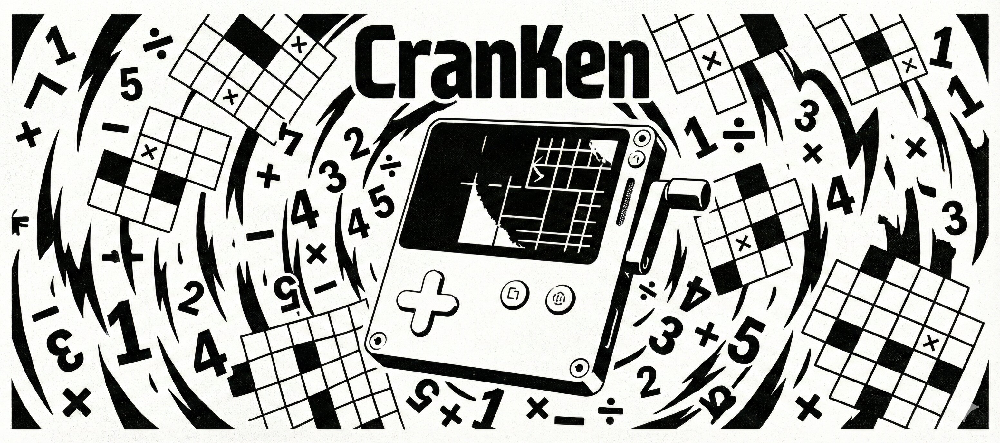

# CranKen

A math puzzle game for the Playdate handheld console, featuring crank-based input for an intuitive solving experience.

**[Play on itch.io](https://geistpro.itch.io/cranken)**

## About

CranKen is a digital implementation of math puzzle games, designed specifically for the Playdate's unique hardware. Players solve number puzzles by filling grids with digits while satisfying mathematical cage constraints, using the Playdate's crank for smooth number input.

## Game Features

- **Multiple Grid Sizes**: Choose from 3x3 up to 9x9 puzzle grids
- **Crank Controls**: Use the Playdate's crank to cycle through numbers intuitively
- **Traditional Controls**: Alternative button-based input for number entry
- **Procedural Generation**: Dynamically generated puzzles with valid solutions
- **Visual Feedback**: Clear cage boundaries and target display
- **Completion Detection**: Automatic puzzle validation and victory screen

## How to Play

### Basic Rules
1. Fill each cell in the grid with numbers from 1 to N (where N is the grid size)
2. Each row and column must contain each number exactly once (like Sudoku)
3. Each outlined cage must satisfy its mathematical operation and target number

### Controls
- **D-pad**: Navigate between cells
- **🅰 Button**: Cycle numbers forward (0 → 1 → 2 → ... → N → 0)
- **🅱 Button**: Cycle numbers backward
- **Crank**: Rotate to cycle through numbers (180° per number)
- **Menu Button**: Clear current cell
- **🅰 (Size Selection)**: Start game with selected grid size
- **⬆⬇ (Size Selection)**: Change grid size

### Cage Operations
- **Addition (+)**: Sum of all numbers in cage equals target
- **Subtraction (−)**: Absolute difference between two numbers equals target
- **Multiplication (×)**: Product of all numbers in cage equals target
- **Division (÷)**: Division of larger by smaller number equals target
- **Equals (=)**: Single cell must contain the target number

## Installation

1. Copy the game files to your Playdate device or simulator
2. Launch from the Playdate home screen

## Development

### File Structure
```
source/
├── main.lua           # Main game entry point
├── kenken.lua         # Core game logic and UI
├── puzzleGenerator.lua # Puzzle generation system
├── pdxinfo           # Game metadata
├── fonts/            # Custom fonts
└── images/           # Game assets and icons
```

### Technical Details
- Built with Playdate SDK using Lua
- Features procedural Latin square generation
- Implements backtracking algorithm for puzzle creation
- Uses sprite-based rendering for smooth animations

## Author

Kai Kunze

## Version

1.0

---

*CranKen brings classic mathematical puzzle challenges to Playdate with intuitive crank-based controls and procedurally generated gameplay.*